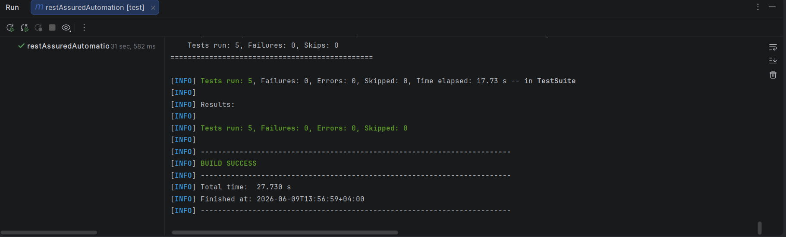
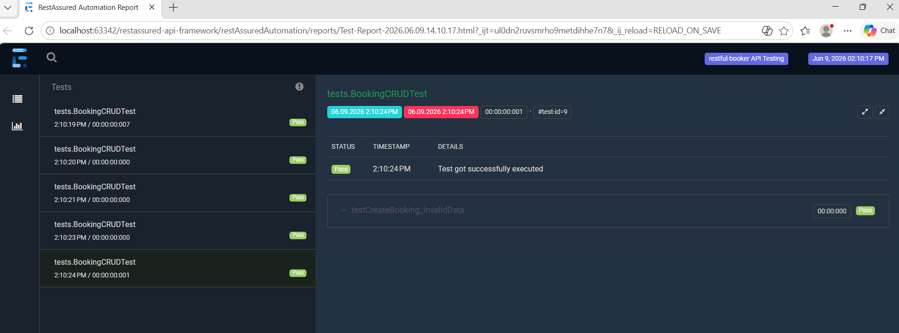

# Restassured API Automation

## 📌 Project Overview
This project is a REST API automation framework for the Restful-booker apis: 👉 https://restful-booker.herokuapp.com/apidoc/index.html

It is built using **Java**, **RestAssured**, **TestNG**, **Maven**, **POJO models**, and **Extent Reports**.

This framework demonstrates enterprise-style API testing practices including request/response specifications, test data management, reporting, and CI/CD integration.

---

## 🎯Key Features
- [x] CRUD API Testing
- [x] Token reuse
- [x] JSON Schema Validations
- [x] POJO based payloads
- [x] Centralized Endpoints
- [x] Negetive Testing
- [x] Logging with Log4j
- [x] HTML Reporting with Extent Reports
- [x] Maven-based build system
- [x] CI Ready

---
## 🚀 Tech Stack
- Java
- RestAssured
- TestNG
- Maven
- Log4j
- Extent Report
- Git / GitHub Actions

---
## 📁 Repository Structure

```
saucedemoAutomation/
│
├── src/
│   ├── test/java/
│   │   ├── base/
│   │   ├── endpoints/
│   │   ├── models/
│   │   ├── tests/
│   │   └── utilities/
│   └── resources
├── testng.xml
├── pom.xml
├── README.md
├── logs/
└── reports/

```
---
## ⚙️ Getting Started

1.Clone the project
```
git clone https://github.com/prasadiUoR/restassured-api-framework
```
2.Go to the project directory
```
cd restAssuredAutomation
```
3.Install Dependencies
```
mvn clean install
```
4.Run tests
```
mvn test
```
5.Run TestNG suite
```
mvn test -DsuiteXmlFile=testng.xml
```
---
## GitHub Actions

Tests are automatically executed on:

- Push to main branch
- Pull Requests

Pipeline performs:

1. Checkout Repository
2. Setup Java 17
3. Execute Maven Tests
4. Publish Test Artifacts
---
## Project Results
- Test Execution Screenshot
  
  
- Extent Report Screenshot
  
  


---  
## Future Enhancements

- Parallel execution support
- Dockerized test execution
- Allure reporting upgrade
